## Task 1: Launching your EC2 instance

In this task, you launch an EC2 instance with termination protection. Termination protection prevents you from accidentally terminating an EC2 instance. You also deploy your instance with a user data script to deploy a simple web server.

In the AWS Management Console on the Services menu, enter EC2. From the search results, choose EC2.

In the left navigation pane, choose EC2 Dashboard to ensure that you are on the dashboard page.

In the Launch instance section, choose the Launch instance button.

- STEP 1: NAME YOUR EC2 INSTANCE

Using tags, you can categorize your AWS resources in different ways (for example, by purpose, owner, or environment). This categorization is useful when you have many resources of the same type. You can quickly identify a specific resource based on the tags that you have assigned to it. Each tag consists of a key and a value, both of which you define.

When you name your instance, AWS creates a key-value pair. The key for this pair is Name, and the value is the name that you enter for your EC2 instance.

In the Name and tags pane, in the Name text box, enter 
```
my-ec2-web-server
```
Choose the Add additional tags link.
From the Resource types dropdown list, 
```
select Instances and Volumes.
```
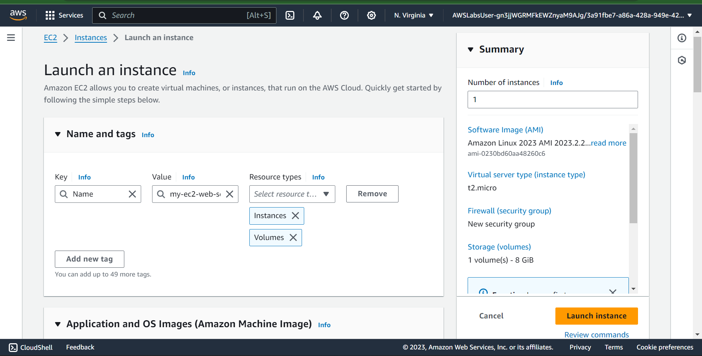
___

- STEP 2: CHOOSE AN AMI

An Amazon Machine Image (AMI) provides the information required to launch an instance, which is a virtual server in the cloud. An AMI includes the following:

A template for the root volume for the instance (for example, an operating system or an application server with applications)
Launch permissions that control which AWS accounts can use the AMI to launch instances
A block device mapping that specifies the volumes to attach to the instance when it is launched
The Quick Start list contains the most commonly used AMIs. You can also create your own AMI or select an AMI from the AWS Marketplace, an online store where you can sell or buy software that runs on AWS.

Locate the Application and OS Images (Amazon Machine Image) section. It is just below the Name and tags section.
In the search box, enter 
```
Windows Server 2019 Base
```
 and press Enter.

Next to Microsoft Windows Server 2019 Base, choose Select.
Choose Confirm Changes.


___
- STEP 3: CHOOSE AN INSTANCE TYPE

Amazon EC2 provides a wide selection of instance types that are optimized to fit different use cases. Instance types comprise varying combinations of CPU, memory, storage, and networking capacity and give you the flexibility to choose the appropriate mix of resources for your applications. Each instance type includes one or more instance sizes so that you can scale your resources to the requirements of your target workload.

In this step, you choose a 
```
t2.micro 
```
instance. This instance 
type has 1 virtual CPU and 1 GiB of memory.

In the Instance type section, keep the default instance type, t2.micro.

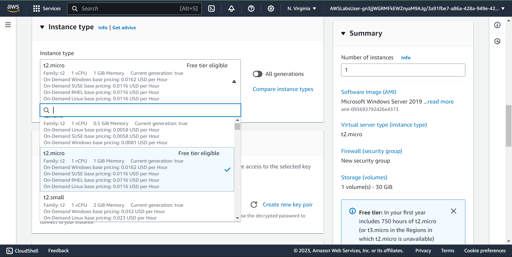
___

- STEP 4: CONFIGURE A KEY PAIR

Amazon EC2 uses public key cryptography to encrypt and decrypt login information. To log in to your instance, you must create a key pair, specify the name of the key pair when you launch the instance, and provide the private key when you connect to the instance.

In this lab, you do not connect to your instance using an SSH key, so you do not need to configure a key pair.
```
N/B: key pair is needed only for ssh login to ec2 instance
```
In the Key pair (login) section, from the Key pair name - required dropdown list, choose Proceed without a key pair (not recommended).

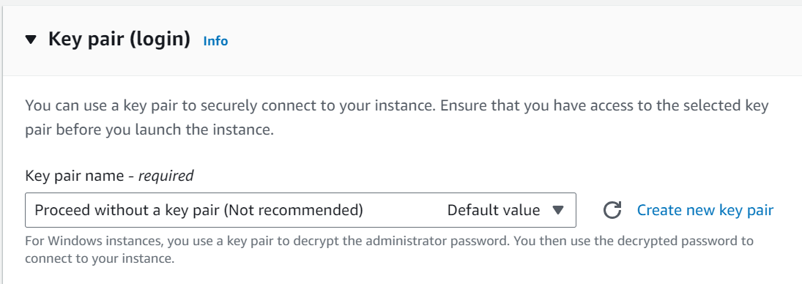
___

- STEP 5: CONFIGURE THE NETWORK SETTINGS

You use this pane to configure networking settings.

The virtual private cloud (VPC) indicates which VPC you want to launch the instance into. You can have multiple VPCs, including different ones for development, testing, and production.

In the Network settings section, choose Edit.

From the VPC - required dropdown list, choose Lab VPC.

The Lab VPC was created using an AWS CloudFormation template during the setup process of your lab. This VPC includes two public subnets in two different Availability Zones.

For Security group name - required, choose Select existing security group.

From Common security groups, select Web Server security group.

A security group acts as a virtual firewall that controls the traffic for one or more instances. When you launch an instance, you associate one or more security groups with the instance. You add rules to each security group that allow traffic to or from its associated instances. You can modify the rules for a security group at any time; the new rules are automatically applied to all instances that are associated with the security group.

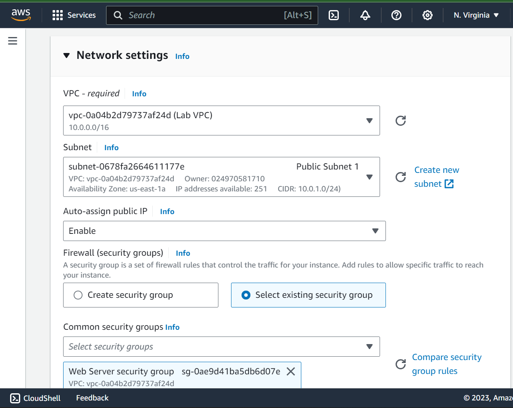
___

- STEP 6: ADD STORAGE

Amazon EC2 stores data on a network-attached virtual disk called Amazon Elastic Block Store (Amazon EBS).

You launch the EC2 instance using a default 30 GiB disk volume. This is your root volume (also known as a boot volume).

In the Configure storage section, keep the default storage configuration.
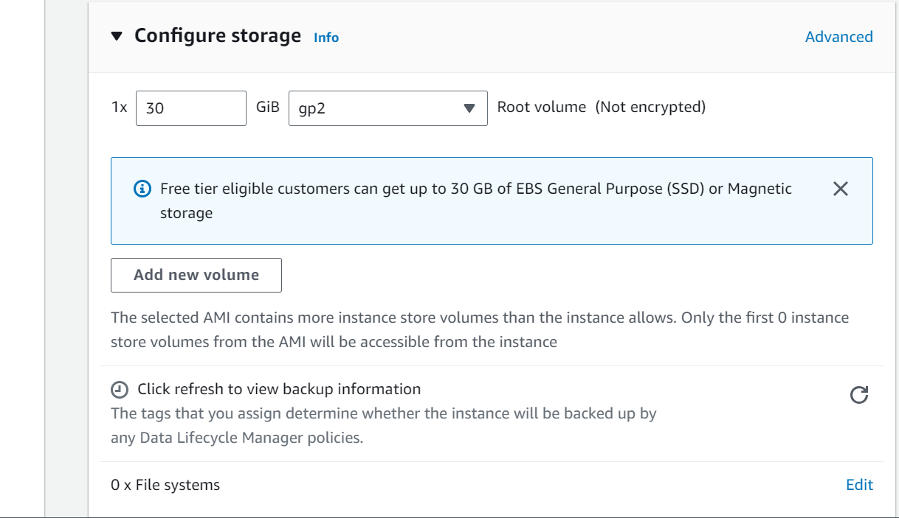
___

- STEP 7: CONFIGURE ADVANCED DETAILS

Expand the Advanced details section.

For IAM instance profile, choose the role that has LabInstanceProfile in the name.

When you no longer require an EC2 instance, you can terminate it, which means that the instance stops, and Amazon EC2 releases the instance’s resources. You cannot restart a terminated instance. If you want to prevent your users from accidentally terminating the instance, you can turn on (enable) termination protection for the instance, which prevents users from terminating instances.

From the Termination protection dropdown list, choose Enable.
When you launch an instance in Amazon EC2, you have the option of passing user data to the instance. These commands can be used to perform common automated configuration tasks and even run scripts after the instance starts.

Copy the following commands, and paste them into the User data text box.
```
<powershell>
# Installing web server
Install-WindowsFeature -name Web-Server -IncludeManagementTools
# Getting website code
wget https://us-east-1-tcprod.s3.amazonaws.com/courses/CUR-TF-100-EDCOMP/v1.0.4.prod-ef70397c/01-lab-ec2/scripts/code.zip -outfile "C:\Users\Administrator\Downloads\code.zip"
# Unzipping website code
Add-Type -AssemblyName System.IO.Compression.FileSystem
function Unzip
{
    param([string]$zipfile, [string]$outpath)
    [System.IO.Compression.ZipFile]::ExtractToDirectory($zipfile, $outpath)
}
Unzip "C:\Users\Administrator\Downloads\code.zip" "C:\inetpub\"
# Setting Administrator password
$Secure_String_Pwd = ConvertTo-SecureString "P@ssW0rD!" -AsPlainText -Force
$UserAccount = Get-LocalUser -Name "Administrator"
$UserAccount | Set-LocalUser -Password $Secure_String_Pwd
</powershell>

```
The script does the following:

1. Installs a Microsoft Internet Information Services (IIS) web server
2. Creates a simple web site
3. Sets the password for the Administrator user

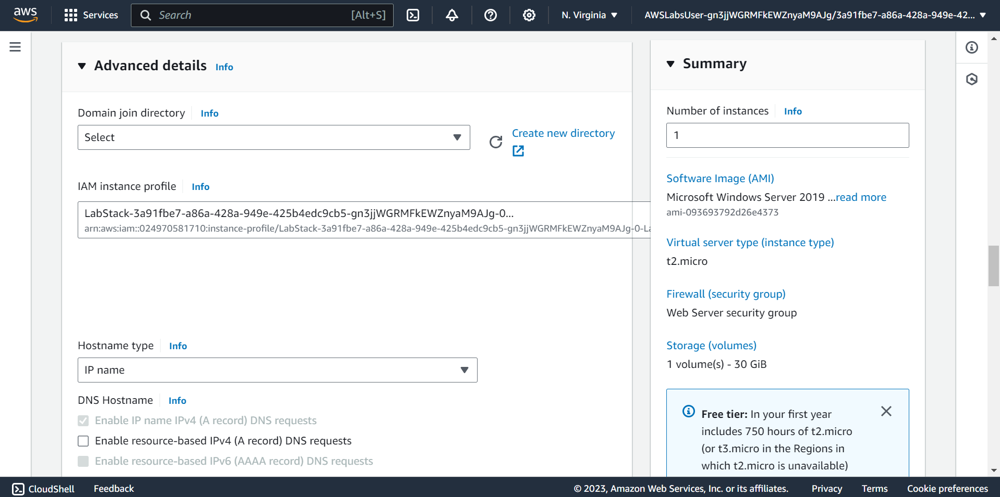
___
- STEP 8: LAUNCH AN EC2 INSTANCE

Now that you have configured your EC2 instance settings, it is time to launch your instance.

In the Summary section, choose Launch instance.
A message indicates that you have successfully initiated the launch of your instance.

Choose View all instances
The instance appears in a Pending state, which means that it is being launched. It then changes to Running, which indicates that the instance has started booting. There will be a short time before you can access the instance.

The instance receives a public Domain Name System (DNS) name that you can use to contact the instance from the Internet.

Next to your Web-Server, select the  check box. The Details tab displays detailed information about your instance.
 To view more information in the Details tab, drag the window divider upward.

Review the information displayed in the Details, Security and Networking tabs.

Wait for your instance to display the following:
Note: Refresh if needed.
```
Instance State:  Running
Status Checks:  2/2 checks passed
```
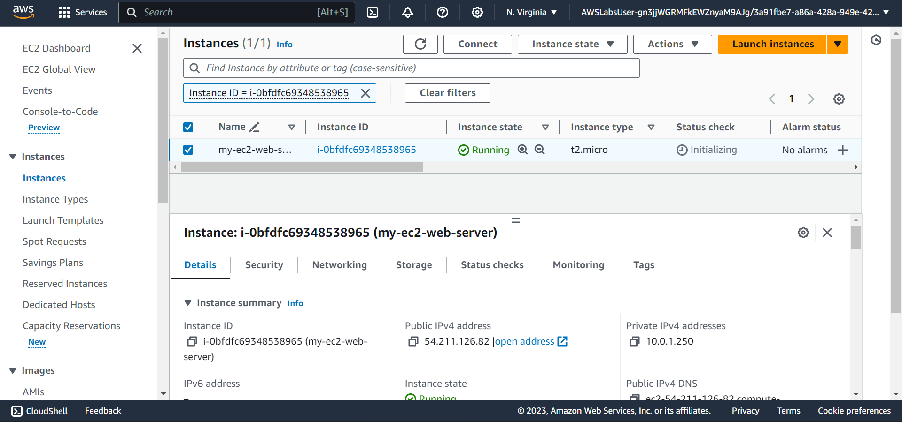
___

## Task 2: Monitor your instance
Monitoring is an important part of maintaining the reliability, availability, and performance of your EC2 instances and your AWS solutions.

Choose the Status checks tab.
With instance status monitoring, you can quickly determine whether Amazon EC2 has detected any problems that might prevent your instances from running applications. Amazon EC2 performs automated checks on every running EC2 instance to identify hardware and software issues.

Notice that both the System reachability and Instance reachability checks have passed.

Choose the Monitoring tab.
This tab displays Amazon CloudWatch metrics for your instance. Currently, there are not many metrics to display because the instance was recently launched.

You can choose a graph to see an expanded view.

Amazon EC2 sends metrics to Amazon CloudWatch for your EC2 instances. Basic (5 minute) monitoring is turned on by default and is free. You can turn on detailed (1 minute) monitoring. With detailed monitoring, you will be charged per metric that you send to CloudWatch.

At the top of the page, choose the Actions  dropdown menu. Select Monitor and troubleshoot  Get system log.
The system log displays the console output of the instance, which is a valuable tool for problem diagnosis. It is especially useful for troubleshooting service configuration issues that could cause an instance to terminate or become unreachable. If you do not see a system log, wait a few minutes and then try again.

Scroll through the log and review the messages in the output.

To return to the Amazon EC2 dashboard, choose Cancel.

With your Web-Server selected, choose the Actions  dropdown menu, and select Monitor and troubleshoot  Get instance screenshot.

This option shows you what your EC2 instance console would look like if a screen were attached to it. Because this is a Windows instance, the screenshot shows a locked log-in screen.
```
monitoring enabled at 5min
system logs
instance screenshot

```
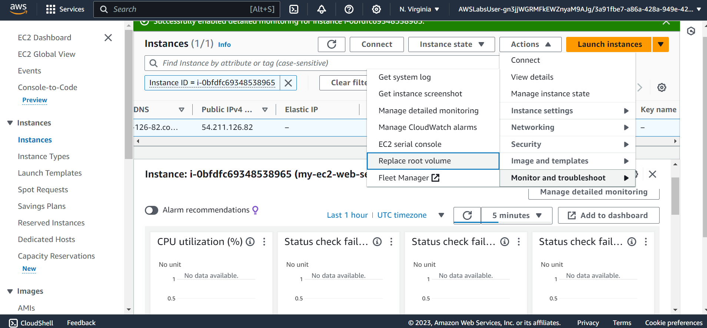
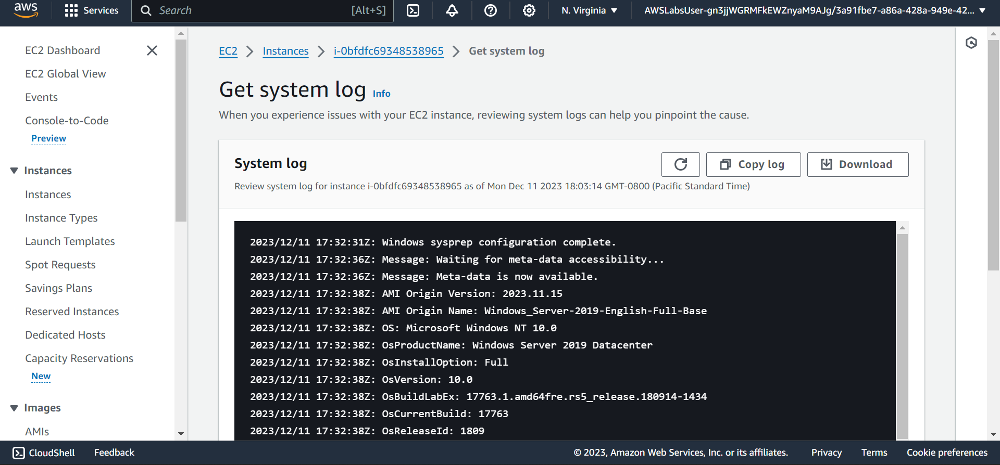
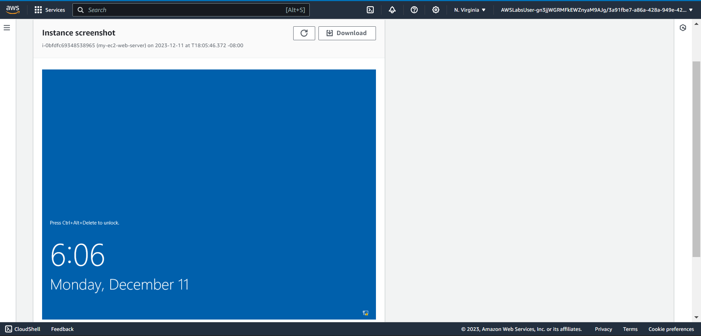
___

## Task 3: Updating your security group and accessing the web server

When you launched the EC2 instance, you provided a script that installed a web server and created a simple web page. In this task, you access content from the web server.

Select the check box next to the Amazon EC2 Web-Server that you created, and then choose the Details tab.

Copy the Public IPv4 address of your instance to your clipboard.
```
my-ec2-web-server ipv4 address: 54.211.126.82
```

In your web browser, open a new tab, paste the IP address you just copied, and then press Enter.

Question: Are you able to access your web server? Why not?

You are not currently able to access your web server because the security group is not permitting inbound traffic on port 80, which is used for HTTP web requests. This step is a demonstration of how to use a security group as a firewall to restrict the network traffic that is allowed in and out of an instance.

To correct this issue, you now update the security group to permit web traffic on port 80.

Keep the browser tab open, but return to the EC2 Management Console tab.

In the left navigation pane, choose Security Groups.

Next to Web Server security group, select the  check box.

Choose the Inbound rules tab.

The security group currently has no rules.
Choose Edit inbound rules, and then choose Add rule, and configure the following options:

Type: Choose 
```
HTTP
```
Source: Choose 
```
Anywhere-IPv4
```
Security group set to allow inbound rule from http port 80


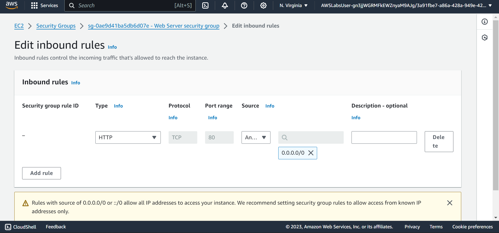

